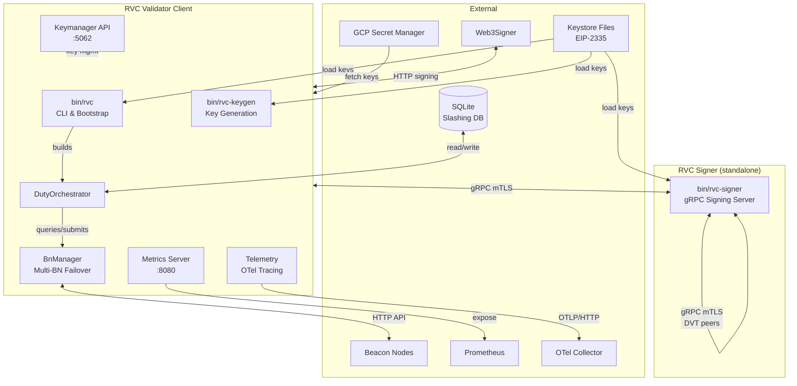
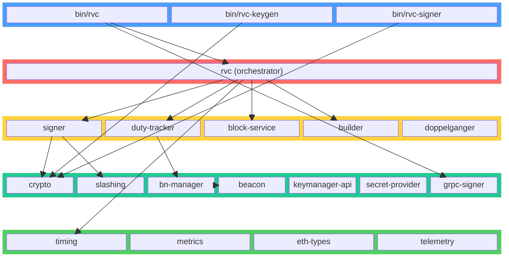
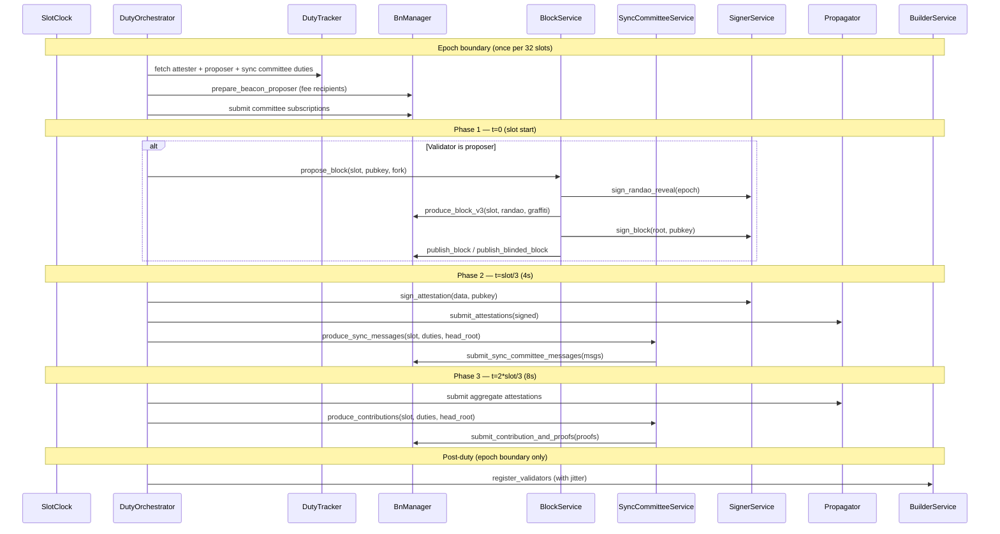
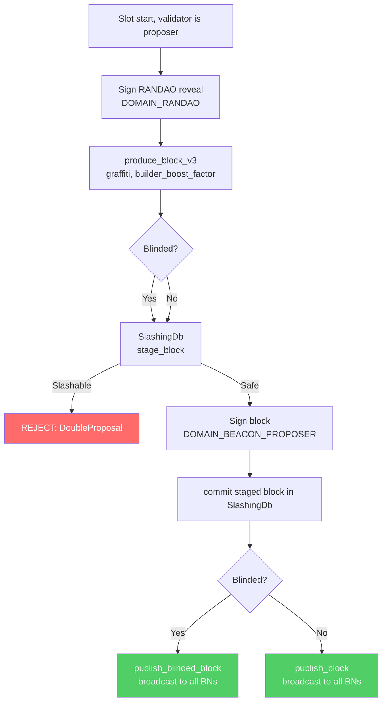
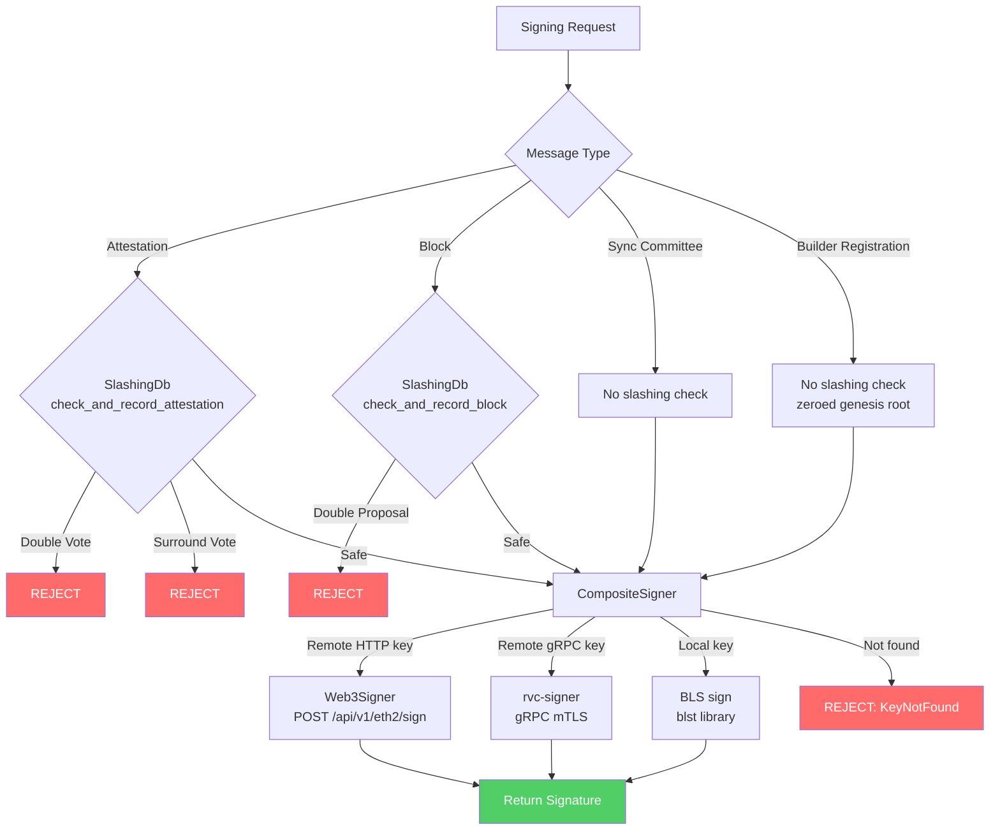
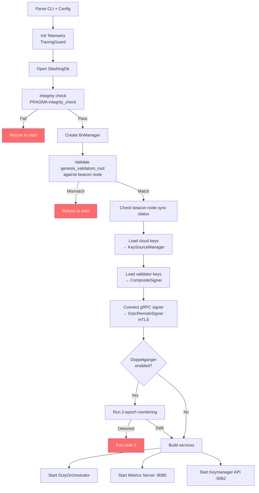
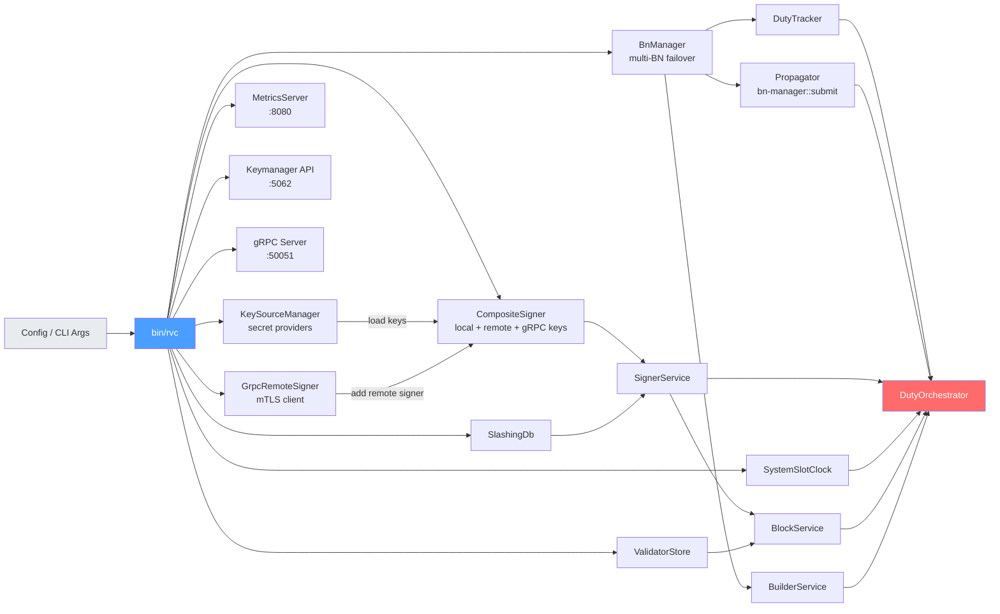

# Architecture

<!-- BEGIN GENERATED -->
RVC is a Rust-based Ethereum Validator Client built as a modular workspace of 32 crates (3 binaries + 29 libraries).

> **Generated section.** Crate count and the dependency graph below are produced from `cargo metadata --format-version=1 --no-deps`. Do not hand-edit this block (the HTML comment markers that wrap it). Regenerate with:
> ```
> make architecture-doc   # or: cargo run -p rvc-architecture-tests --bin generate-architecture-md
> ```

## Crate Dependency Graph

```mermaid
graph TD
    BEACON["beacon<br/><i>HTTP client</i>"]
    RVC["rvc<br/><i>orchestrator</i>"]
    RVC_ARCHITECTURE_TESTS["architecture-tests<br/><i>DAG + doc gates</i>"]
    RVC_BIN["bin/rvc<br/><i>CLI entry point</i>"]
    RVC_BLOCK_SERVICE["block-service<br/><i>block proposals</i>"]
    RVC_BN_MANAGER["bn-manager<br/><i>multi-BN</i>"]
    RVC_BUILDER["builder<br/><i>MEV registration</i>"]
    RVC_CONFIG["config<br/><i>operator config names domain concepts</i>"]
    RVC_CRYPTO["crypto<br/><i>BLS, EIP-2333, keystore</i>"]
    RVC_DOPPELGANGER["doppelganger<br/><i>duplicate detection</i>"]
    RVC_DUTY_TRACKER["duty-tracker<br/><i>duty cache</i>"]
    RVC_ETH_TYPES["eth-types<br/><i>consensus types</i>"]
    RVC_GLOAS["rvc-gloas<br/><i>Gloas progressive SSZ</i>"]
    RVC_GRPC_SIGNER["grpc-signer<br/><i>gRPC signer client</i>"]
    RVC_KEYGEN["bin/rvc-keygen<br/><i>key generation</i>"]
    RVC_KEYMANAGER_API["keymanager-api<br/><i>key mgmt REST</i>"]
    RVC_METRICS["metrics<br/><i>prometheus</i>"]
    RVC_OBSERVABILITY["observability<br/><i>logging helpers</i>"]
    RVC_REMOTE_SIGNER_CLIENT["remote-signer-client<br/><i>Web3Signer HTTP client</i>"]
    RVC_SECRET_PROVIDER["secret-provider<br/><i>cloud key mgmt</i>"]
    RVC_SIGNER["signer<br/><i>safe signing</i>"]
    RVC_SIGNER_BIN["bin/rvc-signer<br/><i>gRPC signing server</i>"]
    RVC_SIGNER_PROTO["signer-proto<br/><i>gRPC protobuf</i>"]
    RVC_SIGNER_REGISTRY["signer-registry<br/><i>sign type table</i>"]
    RVC_SIGNER_SERVER["signer-server<br/><i>remote signing lib</i>"]
    RVC_SLASHING["slashing<br/><i>EIP-3076</i>"]
    RVC_SPEC_VECTORS["spec-vectors<br/><i>spec vectors + KAT codegen</i>"]
    RVC_TELEMETRY["telemetry<br/><i>OTel tracing</i>"]
    RVC_TEST_SUPPORT["test-support<br/><i>PKI + mTLS harness</i>"]
    RVC_TIMING["timing<br/><i>slot clock</i>"]
    RVC_VALIDATOR_STORE["validator-store<br/><i>validator config</i>"]
    RVC_WEB3SIGNER_WIRE["web3signer-wire<br/><i>remote sign wire</i>"]

    BEACON --> RVC_ETH_TYPES
    BEACON --> RVC_OBSERVABILITY
    BEACON --> RVC_TELEMETRY
    RVC --> BEACON
    RVC --> RVC_BLOCK_SERVICE
    RVC --> RVC_BN_MANAGER
    RVC --> RVC_BUILDER
    RVC --> RVC_CONFIG
    RVC --> RVC_CRYPTO
    RVC --> RVC_DOPPELGANGER
    RVC --> RVC_DUTY_TRACKER
    RVC --> RVC_ETH_TYPES
    RVC --> RVC_GRPC_SIGNER
    RVC --> RVC_KEYMANAGER_API
    RVC --> RVC_METRICS
    RVC --> RVC_OBSERVABILITY
    RVC --> RVC_REMOTE_SIGNER_CLIENT
    RVC --> RVC_SECRET_PROVIDER
    RVC --> RVC_SIGNER
    RVC --> RVC_SLASHING
    RVC --> RVC_TIMING
    RVC --> RVC_VALIDATOR_STORE
    RVC_BIN --> BEACON
    RVC_BIN --> RVC
    RVC_BIN --> RVC_BN_MANAGER
    RVC_BIN --> RVC_CRYPTO
    RVC_BIN --> RVC_ETH_TYPES
    RVC_BIN --> RVC_KEYMANAGER_API
    RVC_BIN --> RVC_METRICS
    RVC_BIN --> RVC_SIGNER
    RVC_BIN --> RVC_SLASHING
    RVC_BIN --> RVC_TELEMETRY
    RVC_BLOCK_SERVICE --> BEACON
    RVC_BLOCK_SERVICE --> RVC_CRYPTO
    RVC_BLOCK_SERVICE --> RVC_ETH_TYPES
    RVC_BLOCK_SERVICE --> RVC_OBSERVABILITY
    RVC_BLOCK_SERVICE --> RVC_SIGNER
    RVC_BLOCK_SERVICE --> RVC_VALIDATOR_STORE
    RVC_BN_MANAGER --> BEACON
    RVC_BN_MANAGER --> RVC_ETH_TYPES
    RVC_BN_MANAGER --> RVC_METRICS
    RVC_BN_MANAGER --> RVC_OBSERVABILITY
    RVC_BUILDER --> RVC_BN_MANAGER
    RVC_BUILDER --> RVC_CRYPTO
    RVC_BUILDER --> RVC_ETH_TYPES
    RVC_BUILDER --> RVC_SIGNER
    RVC_BUILDER --> RVC_VALIDATOR_STORE
    RVC_CONFIG --> RVC_ETH_TYPES
    RVC_CRYPTO --> RVC_ETH_TYPES
    RVC_CRYPTO --> RVC_OBSERVABILITY
    RVC_DOPPELGANGER --> RVC_CRYPTO
    RVC_DOPPELGANGER --> RVC_ETH_TYPES
    RVC_DOPPELGANGER --> RVC_OBSERVABILITY
    RVC_DOPPELGANGER --> RVC_SLASHING
    RVC_DUTY_TRACKER --> RVC_BN_MANAGER
    RVC_DUTY_TRACKER --> RVC_ETH_TYPES
    RVC_DUTY_TRACKER --> RVC_METRICS
    RVC_GLOAS --> RVC_ETH_TYPES
    RVC_GRPC_SIGNER --> RVC_CRYPTO
    RVC_GRPC_SIGNER --> RVC_ETH_TYPES
    RVC_GRPC_SIGNER --> RVC_OBSERVABILITY
    RVC_GRPC_SIGNER --> RVC_SIGNER_PROTO
    RVC_KEYGEN --> RVC_CRYPTO
    RVC_KEYGEN --> RVC_ETH_TYPES
    RVC_KEYGEN --> RVC_OBSERVABILITY
    RVC_KEYMANAGER_API --> RVC_ETH_TYPES
    RVC_KEYMANAGER_API --> RVC_METRICS
    RVC_KEYMANAGER_API --> RVC_OBSERVABILITY
    RVC_REMOTE_SIGNER_CLIENT --> RVC_CRYPTO
    RVC_REMOTE_SIGNER_CLIENT --> RVC_ETH_TYPES
    RVC_REMOTE_SIGNER_CLIENT --> RVC_OBSERVABILITY
    RVC_REMOTE_SIGNER_CLIENT --> RVC_WEB3SIGNER_WIRE
    RVC_SECRET_PROVIDER --> RVC_CRYPTO
    RVC_SECRET_PROVIDER --> RVC_ETH_TYPES
    RVC_SECRET_PROVIDER --> RVC_METRICS
    RVC_SECRET_PROVIDER --> RVC_OBSERVABILITY
    RVC_SIGNER --> RVC_CRYPTO
    RVC_SIGNER --> RVC_DOPPELGANGER
    RVC_SIGNER --> RVC_ETH_TYPES
    RVC_SIGNER --> RVC_METRICS
    RVC_SIGNER --> RVC_OBSERVABILITY
    RVC_SIGNER --> RVC_SLASHING
    RVC_SIGNER_BIN --> RVC_SIGNER_SERVER
    RVC_SIGNER_BIN --> RVC_TELEMETRY
    RVC_SIGNER_SERVER --> RVC_CRYPTO
    RVC_SIGNER_SERVER --> RVC_ETH_TYPES
    RVC_SIGNER_SERVER --> RVC_OBSERVABILITY
    RVC_SIGNER_SERVER --> RVC_SIGNER
    RVC_SIGNER_SERVER --> RVC_SIGNER_PROTO
    RVC_SIGNER_SERVER --> RVC_SLASHING
    RVC_SIGNER_SERVER --> RVC_TELEMETRY
    RVC_SIGNER_SERVER --> RVC_WEB3SIGNER_WIRE
    RVC_SLASHING --> RVC_ETH_TYPES
    RVC_SLASHING --> RVC_METRICS
    RVC_SLASHING --> RVC_OBSERVABILITY
    RVC_TIMING --> RVC_ETH_TYPES
    RVC_VALIDATOR_STORE --> RVC_ETH_TYPES
    RVC_VALIDATOR_STORE --> RVC_OBSERVABILITY
    RVC_WEB3SIGNER_WIRE --> RVC_ETH_TYPES

    style BEACON fill:#20c997,color:#fff
    style RVC fill:#ff6b6b,color:#fff
    style RVC_ARCHITECTURE_TESTS fill:#adb5bd,color:#333
    style RVC_BIN fill:#4a9eff,color:#fff
    style RVC_BLOCK_SERVICE fill:#ffd43b,color:#333
    style RVC_BN_MANAGER fill:#20c997,color:#fff
    style RVC_BUILDER fill:#ffd43b,color:#333
    style RVC_CONFIG fill:#ffd43b,color:#333
    style RVC_CRYPTO fill:#51cf66,color:#fff
    style RVC_DOPPELGANGER fill:#ffd43b,color:#333
    style RVC_DUTY_TRACKER fill:#ffd43b,color:#333
    style RVC_ETH_TYPES fill:#51cf66,color:#fff
    style RVC_GLOAS fill:#51cf66,color:#fff
    style RVC_GRPC_SIGNER fill:#20c997,color:#fff
    style RVC_KEYGEN fill:#4a9eff,color:#fff
    style RVC_KEYMANAGER_API fill:#20c997,color:#fff
    style RVC_METRICS fill:#51cf66,color:#fff
    style RVC_OBSERVABILITY fill:#51cf66,color:#fff
    style RVC_REMOTE_SIGNER_CLIENT fill:#20c997,color:#fff
    style RVC_SECRET_PROVIDER fill:#20c997,color:#fff
    style RVC_SIGNER fill:#ffd43b,color:#333
    style RVC_SIGNER_BIN fill:#4a9eff,color:#fff
    style RVC_SIGNER_PROTO fill:#51cf66,color:#fff
    style RVC_SIGNER_REGISTRY fill:#51cf66,color:#fff
    style RVC_SIGNER_SERVER fill:#ffd43b,color:#333
    style RVC_SLASHING fill:#20c997,color:#fff
    style RVC_SPEC_VECTORS fill:#adb5bd,color:#333
    style RVC_TELEMETRY fill:#51cf66,color:#fff
    style RVC_TEST_SUPPORT fill:#adb5bd,color:#333
    style RVC_TIMING fill:#51cf66,color:#fff
    style RVC_VALIDATOR_STORE fill:#20c997,color:#fff
    style RVC_WEB3SIGNER_WIRE fill:#51cf66,color:#fff
```



**Layer colors:**
- **Blue** — Binary entry point
- **Red** — Core orchestrator (depends on domain + base/infra crates)
- **Yellow** — Domain crates (duty-specific logic)
- **Green** — Base crates (pure leaves; no I/O)
- **Teal** — Infra crates (I/O services; no domain orchestration)
- **Gray** — Meta / dev-only crates (architecture gates, test harnesses)
<!-- END GENERATED -->

RVC handles the full validator lifecycle: block proposals, attestations, sync committee participation, aggregation duties, slashing protection, multi-BN failover, doppelganger detection, MEV/builder integration, runtime key management via the Keymanager API, key generation, distributed tracing via OpenTelemetry, and remote/distributed signing via gRPC.

## System Overview



## Crate Layer Diagram



## Slot Processing — 3-Phase Architecture



## Block Proposal Lifecycle



## Signing Flow



## Startup Sequence



## Service Construction



## Workspace Crates

### `bin/rvc` — CLI Entry Point

Binary crate. Parses CLI arguments (via `clap`), loads TOML configuration, initializes logging, runs the startup sequence (slashing integrity → genesis validation → BN sync check → doppelganger detection), builds all services, and runs the `DutyOrchestrator`. Manages graceful shutdown on SIGTERM/SIGINT. Optionally starts the Keymanager API server and configures remote signing.

### `bin/rvc-keygen` — Key Generation Tool

Binary crate for offline key generation and signing operations. Subcommands:

- **`new-mnemonic`** — Generates a BIP-39 mnemonic (24 words, 256-bit entropy), derives validator keys via EIP-2333 (`m/12381/3600/i/0`), encrypts to EIP-2335 keystores (Scrypt or PBKDF2), and produces Launchpad-compatible deposit data JSON.
- **`existing-mnemonic`** — Regenerates keys from an existing mnemonic with configurable `--start-index` and `--num-validators`.
- **`bls-to-execution`** — Generates `SignedBLSToExecutionChange` messages (`DOMAIN_BLS_TO_EXECUTION_CHANGE` with Capella fork version and actual `genesis_validators_root`).
- **`exit`** — Generates `SignedVoluntaryExit` messages with EIP-7044 fork version cap at Capella.

Supports `--dry-run`, `--password-file`, `--pbkdf2`, `--withdrawal-address`. Networks: mainnet, hoodi, custom.

### `bin/rvc-signer` — Remote BLS Signing Server

Standalone gRPC signing server for key isolation and Distributed Validator Technology (DVT). Subcommands:

- **`serve`** — Starts the gRPC signing server with mTLS. Supports two backends:
  - **`BasicSigner`** — Loads EIP-2335 keystores and performs direct BLS signing.
  - **`DvtSigner`** (feature-gated: `dvt`) — Holds Shamir Secret Sharing (SSS) key shares and coordinates threshold signing with peers.
- **`split-key`** (feature-gated: `dvt`) — Splits a BLS secret key into Shamir shares stored as EIP-2335 keystores.

Features:
- **mTLS-first** — All gRPC channels require mutual TLS certificate verification.
- **Keystore hot-reload** — Periodic directory scanning for new/removed keystores (configurable interval, default 30s).
- **Audit logging** — Structured logs for all sign requests.
- **Prometheus metrics** — Per-backend signing counters and latency histograms (default `:9101`).
- **DVT coordination** — `PeerSignerService` gRPC for partial signature exchange. Lagrange interpolation for share combination.
- **Dry-run mode** — Validates configuration without starting the server.

Defined via `proto/signer.proto`:
- `SignerService` — `Sign`, `ListPublicKeys`, `GetStatus` RPCs.
- `PeerSignerService` — `PartialSign` RPC for DVT peer-to-peer coordination.

### `crates/rvc` — Core Orchestrator

Central coordination crate. Contains:

- **`DutyOrchestrator<C, S, B>`** — Main loop with 3-phase slot processing: t=0 block proposals, t=slot/3 attestations + sync messages, t=2*slot/3 aggregations + contributions. Generic over `SlotClock`, `AttestationSubmitter`, and `BeaconBlockClient` for testability.
- **`Config`** / **`Network`** — Configuration types with network presets (Mainnet, Hoodi, Custom).
- **`OrchestratorConfig`** — Fork schedule, genesis root, shutdown timeout.
- **Adapter modules** — `beacon_adapter`, `doppelganger_adapter`, `keymanager_adapters` bridge domain traits to concrete services.
- **gRPC DutyTracker service** — Exposes a `Healthz` RPC via tonic.

### `crates/bn-manager` — Multi-BN Management

Manages connections to one or more Beacon Nodes with strategy-based selection, health scoring, failover, sync status monitoring, and SSE event subscription.

- **`BeaconNodeClient` trait** — Unified async interface for all BN operations. All domain crates depend on this trait, not on `BeaconClient` directly.
- **`BnManager`** — Wraps multiple `BeaconClient` instances. Selection strategies: `First` (lowest latency), `Best` (highest-value response for block production), `Broadcast` (submit to all BNs).
- **`submit` module** — `Propagator` / `AttestationSubmitter` submit signed attestations and aggregate proofs with topic-gated multi-BN broadcast (absorbed from the former `crates/propagator`).
- **Health scoring** — EMA latency (α=0.3), sliding window error rate, composite score (0.4×latency + 0.6×error).
- **SSE events** — Head, ChainReorg, FinalizedCheckpoint, Block.
- **Sync checking** — Monitors `el_offline`, `is_optimistic`, `sync_distance`.

### `crates/block-service` — Block Proposals

Orchestrates the block proposal lifecycle: RANDAO reveal → block production → slashing check → signing → publication.

- **`BlockService<S, B>`** — Generic over `Signer` trait and `BeaconBlockClient`.
- **`BeaconBlockClient` trait** — `produce_block`, `publish_block`, `publish_blinded_block`.
- Handles both full and blinded (MEV) blocks via `Eth-Execution-Payload-Blinded` header.

### `crates/builder` — MEV & Builder Integration

Builder registration management and proposer preparation.

- **`BuilderService`** — Batch-signs `ValidatorRegistrationV1` with `DOMAIN_APPLICATION_BUILDER` (zeroed genesis root), submits via `register_validator` endpoint.
- **`prepare_proposers`** — Sends fee recipients to BN at epoch start.
- **Jitter** — Random 0–30s delay before registration to spread load.
- Registration runs at epoch boundary AFTER all duty phases.

### `crates/doppelganger` — Doppelganger Detection

Detects duplicate validator instances before activating signing (Lodestar pattern).

- **`ForwardWindowMachine`** — 2-epoch forward-window monitoring via `post_validator_liveness`.
- **Restart-aware** — Validators with recent slashing DB entries skip detection.
- **`ForwardWindowStatus`** — `Unmonitored`, `Pending`, `Safe`, `Detected`.

### `crates/beacon` — Beacon Node HTTP Client

Low-level async HTTP client for the Ethereum Beacon Node API. Provides methods for all standard endpoints: duties, block production, attestations, sync committees, voluntary exits, validator liveness. Includes configurable retry logic with exponential backoff.

Used internally by `bn-manager`; domain crates depend on `BeaconNodeClient` trait instead.

### `crates/eth-types` — Ethereum Consensus Types

Pure data types with SSZ encoding/decoding and tree hashing. Defines all consensus types: `Slot`, `Epoch`, `Root`, `ForkName`, `ForkSchedule`, `AttestationData`, `SingleAttestation` (EIP-7549), `BeaconBlock`, `BlindedBeaconBlock`, `SyncCommitteeMessage`, `SyncCommitteeContribution`, `ValidatorRegistrationV1`, `VoluntaryExit`, `DepositMessage`, `DepositData`, `BLSToExecutionChange`, `SignedBLSToExecutionChange`, and all domain constants.

Quoted-integer serde via `ethereum_serde_utils` for API compatibility. No business logic. No internal dependencies.

### `crates/crypto` — BLS Cryptography, Signing & Key Derivation

Wraps the `blst` library for BLS12-381 operations and provides key generation:

- **`Signer` trait** — Async, object-safe (`dyn Signer`), `Send + Sync`. Abstracts local vs remote signing.
- **`LocalSigner`** — In-memory key manager wrapping `KeyManager`.
- **`RemoteSigner`** — Web3Signer HTTP client (`POST /api/v1/eth2/sign/{identifier}`).
- **`CompositeSigner`** — Routes: remote → dynamic local → base local. Supports runtime key add/remove.
- **`KeyManager`** — Loads EIP-2335 keystores, stores keys in `HashMap<pubkey_hex, SecretKey>`.
- **EIP-2333 HD derivation** — `derive_master_sk`, `derive_child_sk` using HKDF-SHA256 and Lamport scheme. Path: `m/12381/3600/i/0` for signing keys, `m/12381/3600/i/0/0` for withdrawal keys.
- **BIP-39 mnemonic** — Generation (24 words, 256-bit entropy) and seed derivation with optional passphrase.
- **EIP-2335 keystore encryption** — Scrypt and PBKDF2 KDFs, AES-128-CTR cipher, checksum verification.
- **Signing functions** — `sign_attestation`, `sign_block`, `sign_randao_reveal`, `sign_sync_committee_message`, `sign_contribution_and_proof`, `sign_aggregate_and_proof`, `sign_selection_proof`, `sign_voluntary_exit`, `sign_builder_registration`.
- **`Zeroize` on drop**, `SecretString` for passwords.

### `crates/signer` — Safe Signing with Slashing Protection

Combines `crypto` and `slashing` into a safe signing workflow:

- **`SignerService`** — Implements `ValidatorSigner` trait. Every signing operation: slashing check → retrieve key → compute domain → sign → record in DB → update metrics.
- **`ValidatorSigner` trait** — Methods for all message types: attestations, blocks, sync committee, aggregation, RANDAO, voluntary exits, builder registrations.
- **Fail-closed** — Any slashing DB error refuses to sign.

### `crates/slashing` — Slashing Protection (EIP-3076)

SQLite-backed slashing protection for attestations and blocks:

- **Attestation rules** — Double vote, surrounding vote, surrounded vote.
- **Block rule** — Double proposal (same slot, different signing root).
- **`check_and_record_attestation`** / **`check_and_record_block`** — Atomic check-and-record.
- **Integrity checks** — `PRAGMA integrity_check` at startup, genesis root validation.
- **Pruning** — Watermark-based pruning for source epoch, target epoch, and block slot via
  `SlashingDb::prune_below_watermarks`, exposed to operators as `rvc slashing prune`
  (`--slashing-db-path`, `--dry-run`, `--yes`). The prune path refuses to create a fresh
  empty DB on a missing path (same class of footgun as `--init-slashing-db` without opt-in).
  The `rvc_slashing_db_prune_total` metric increments on real prunes.
- **EIP-3076 interchange** — Import/export for keystore migration.
- **Conformance** — 76 EIP-3076 tests (38 complete + 38 minimal strategy).

**Wire-not-delete (B5 / RF2-12 + RF2-13):** the watermark + prune subsystem is intentionally
wired rather than deleted. Phase 1 A1 pinned stage-path watermark equality (`<=` blocks at
the watermark), A2 retargeted conformance + proptests onto `stage_* → commit/discard`, and
the 38 minimal-strategy EIP-3076 conformance cases depend on watermark maxima projected from
interchange import (RF2-12). Deleting watermarks would invalidate that oracle and weaken
minimal-format import safety; RF2-13 completes the operator surface so pruning is reachable.

### `crates/keymanager-api` — Keymanager REST API

HTTP server for runtime key management per the Ethereum Keymanager API standard:

- **Endpoints** — `GET/POST/DELETE /eth/v1/keystores`, `GET/POST/DELETE /eth/v1/remotekeys`.
- **Authentication** — Bearer token (256-bit CSPRNG, hex-encoded, `0o400` file permissions, constant-time comparison via `subtle`, `Zeroizing<String>`).
- **Traits** — `KeystoreManager`, `RemoteKeyManager`, `SlashingProtectionExporter`, `ValidatorManager`, `DoppelgangerMonitor`.
- **Key import** — Imports keystore → adds to `CompositeSigner` → imports slashing protection → triggers doppelganger detection.

### `crates/validator-store` — Per-Validator Configuration

Stores per-validator preferences: fee recipient, graffiti, builder settings.

- **`ValidatorStore`** — TOML-backed config with hot-reload (`reload_config` with parse-first/apply-second atomicity).
- **Queries** — `effective_fee_recipient`, `effective_graffiti`.

### `crates/duty-tracker` — Validator Duty Caching

Fetches and caches attester, proposer, and sync committee duties from the beacon node.

- **Attester duties** — Per-epoch cache with dependent root tracking.
- **Proposer duties** — Per-epoch cache, prefetched at epoch start.
- **Sync committee duties** — Per-sync-committee-period cache (~256 epochs).
- Depends on `BnManager` via `BeaconNodeClient` trait.

### `crates/timing` — Slot Clock

Slot timing abstraction:

- **`SlotClock` trait** — `current_slot()`, `time_until_slot()`, `time_until_attestation()`, epoch/slot conversions.
- **`SystemSlotClock`** — Production implementation using system time relative to genesis.
- **`MockSlotClock`** — Test implementation with configurable time.

### `crates/metrics` — Prometheus Metrics & Health

Global Prometheus metrics registry. Runs an Axum HTTP server exposing `/metrics` and `/healthz` endpoints. Metrics cover slot processing, attestations, blocks, sync committees, aggregation, slashing protection, BN health, builder registrations, keymanager requests, and DB pruning.

### `crates/secret-provider` — Cloud Secret Management

Pluggable secret provider abstraction for loading validator keys from cloud key management services:

- **`SecretProvider` trait** — Async trait with `list_keys()` and `fetch_key(id)`. Implementations: `GcpSecretProvider` (gated behind `gcp-secret` feature), `MockSecretProvider` (test-utils).
- **`KeySourceManager`** — Orchestrates multiple `SecretProvider` instances, loads keys into `CompositeSigner`, returns `LoadSummary` per provider.
- **`RefreshService`** — Periodic key refresh via `CancellationToken`-aware loop, pre-loads new keys into `CompositeSigner`.
- **Format detection** — `parse_secret_data` auto-detects raw hex, 0x-prefixed hex, and EIP-2335 keystore JSON.
- **Observability** — `rvc.secret_provider.*` OTel spans, Prometheus metrics (`keys_loaded`, `errors_total`, `load_duration`).
- **Security** — `Zeroizing<T>` for all key material, `KeyMaterial` intentionally excludes `Debug`.

### `crates/grpc-signer` — gRPC Remote Signer Client

Client library for connecting `bin/rvc` to `bin/rvc-signer` via gRPC with mTLS:

- **`GrpcRemoteSigner`** — Implements the `Signer` trait from `crates/crypto`. Lazily connects to the remote signing server.
- **`GrpcRemoteSignerConfig`** — mTLS configuration (client cert, key, CA cert).
- **Proto stubs** — Re-exports `SignerServiceClient` and `PeerSignerServiceClient` generated from `proto/signer.proto`.
- **Integration** — Added to `CompositeSigner` via `add_remote_signer()` during startup.

### `crates/telemetry` — OpenTelemetry Distributed Tracing

Provides distributed tracing infrastructure using OpenTelemetry:

- **`TelemetryConfig`** — Endpoint, exporter kind, sample rate, batch processor tuning (max queue size, max export batch size).
- **`ExporterKind`** — `Otlp` (OTLP/HTTP on port 4318) or `Gcp` (Cloud Trace, gated behind `gcp-trace` feature).
- **`init_tracing`** — Sets up `tracing-opentelemetry` layer with `ParentBased(TraceIdRatioBased)` sampler. Returns `TracingGuard`.
- **`TracingGuard`** — RAII `#[must_use]` guard that flushes pending spans on drop (5-second timeout).
- **W3C propagation** — Injects `traceparent` headers into outbound beacon node HTTP requests.
- **Instrumentation pattern** — `#[tracing::instrument(name = "rvc.xxx", skip_all, fields(...))]` with dynamic field recording via `Span::current().record()`.

## Key Design Patterns

- **3-phase slot processing** — t=0 blocks, t=slot/3 attestations + sync messages, t=2*slot/3 aggregations + contributions.
- **Trait-based injection** — `BeaconNodeClient`, `SlotClock`, `AttestationSubmitter`, `Signer`, `ValidatorSigner` allow swapping implementations for testing.
- **Composite pattern** — `CompositeSigner` routes local/dynamic/remote keys. `BnManager` routes across multiple BNs.
- **Adapter pattern** — 5 adapters in the orchestrator bridge keymanager-api traits to concrete services.
- **Arc-wrapped services** — All long-lived services are `Arc<T>` for cheap cloning across async tasks.
- **Fail-closed convention** — Safety-critical paths refuse to proceed on uncertainty rather than degrade open:
  - **Signing / slashing DB** — Any slashing-protection error refuses to sign; staged rows are retained on remote-backend timeout when the backend kind is unknown (`RetainStagedRow`).
  - **Enablement defaults** — Validators stay disabled until doppelganger/enablement gates clear; key import does not enable signing immediately.
  - **Startup** — Slashing DB integrity failure, genesis-validators-root mismatch, and missing DB without `--init-slashing-db` refuse to start (no silent empty-DB create).
  - Prefer typed `Result` flows with explicit allow-lists for any intentional degradation.
- **Downward-only dependencies** — Binary → Orchestrator → Domain → Base/Infra. Never upward. The generated graph and `architecture_no_cycles` gate enforce this.
- **Shutdown idiom** — **`tokio_util::sync::CancellationToken`** is the workspace standard for service lifecycle (supports `child_token` hierarchies). Older loops still use `tokio::sync::watch` (orchestrator coordinator, bn-manager SSE/sync, timing); `bin/rvc` bridges the two. New code and opportunistic rewrites adopt `CancellationToken`; do not introduce new `watch`-based shutdown channels.
- **Distributed tracing** — OpenTelemetry spans across slot lifecycle, block proposals, attestations, signing, and beacon HTTP requests with W3C trace context propagation.
- **Pluggable secret providers** — `SecretProvider` trait enables cloud key management (GCP Secret Manager) with periodic refresh and `Zeroizing` key material.
- **Remote signing isolation** — `rvc-signer` runs as a standalone process with mTLS; keys never leave the signer. Slashing protection remains in `rvc`.
- **DVT threshold signing** — Optional Shamir Secret Sharing backend with peer-to-peer partial signature coordination and Lagrange interpolation.
- **KAT-first root tests** — Signing-root and container `hash_tree_root` tests assert against reference-client / consensus-spec vectors (`EXTERNAL_*` / `KAT_*` / `SPEC_*`); self-consistency-only checks are banned as sole coverage. Enforced by `crates/architecture-tests/tests/kat_policy.rs` (RF6-22 / H5). Review checklist: new `*_root` / `*tree_hash*` / `*signing_root*` tests must be KAT-anchored or `// kat_exempt: reason`.

## Consensus Protocol Parameters

| Parameter | Value |
|---|---|
| Slot duration | 12 seconds |
| Slots per epoch | 32 |
| Epoch duration | 6.4 minutes |
| Block proposal timing | slot start (t=0) |
| Attestation timing | slot_start + slot_duration / 3 (4s) |
| Aggregation timing | slot_start + 2 * slot_duration / 3 (8s) |
| BLS scheme | BLS12-381, min-pk variant |
| Slashing protection | EIP-3076 (conservative) |
| Keystore format | EIP-2335 |
| Keymanager API | Standard Ethereum Keymanager API |
| Supported forks | Phase0, Altair, Bellatrix, Capella, Deneb, Electra |

## Configuration & Deployment

The validator client is configured via a TOML file (`config.toml`) or CLI flags:

- Beacon node endpoint(s) (multi-BN supported)
- Keystore directory path and password file
- Slashing DB path
- Fee recipient (default + per-validator overrides)
- Graffiti (default + per-validator overrides)
- Builder preferences (enabled, boost factor)
- Doppelganger detection (`--no-doppelganger` to disable)
- Keymanager API (`--keymanager-enabled`, address, token file)
- Remote signer URL (`--remote-signer-url`)
- Metrics port (default 8080) with `/metrics` and `/healthz`
- gRPC port (default 50051) with `Healthz` RPC
- Network preset or custom genesis parameters
- Per-operation timeouts (attestation, block production, aggregate, sync committee)
- Strict slashing semantics (`--strict-slashing-semantics`)
- Strict file permissions checking (`--strict-permissions`)
- Secret provider (`--secret-provider gcp`, `--gcp-project-id`, `--secret-refresh-interval`)
- OpenTelemetry tracing endpoint, exporter (`otlp` or `gcp`), sample rate, batch processor tuning
- gRPC remote signer (`--grpc-signer-url`, `--grpc-signer-tls-cert`, `--grpc-signer-tls-key`, `--grpc-signer-tls-ca-cert`)
