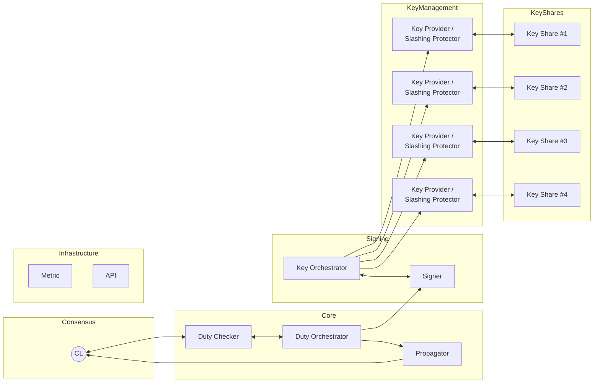

# Overall Architecture

```mermaid
flowchart LR
    subgraph Consensus
        CL((CL))
    end

    subgraph Core
        DC[Duty Checker]
        DO[Duty Orchestrator]
        PR[Propagator]
    end

    subgraph Signing
        KO[Key Orchestrator]
        SG[Signer]
    end

    subgraph KeyManagement
        KP1[Key Provider /<br>Slashing Protector]
        KP2[Key Provider /<br>Slashing Protector]
        KP3[Key Provider /<br>Slashing Protector]
        KP4[Key Provider /<br>Slashing Protector]
    end

    subgraph KeyShares
        KS1[Key Share #1]
        KS2[Key Share #2]
        KS3[Key Share #3]
        KS4[Key Share #4]
    end

    subgraph Infrastructure
        MT[Metric]
        API[API]
    end

    CL <--> DC
    DC <--> DO
    DO --> SG
    DO --> PR
    PR --> CL
    
    KO <--> SG
    KO --> KP1
    KO --> KP2
    KO --> KP3
    KO --> KP4

    KP1 <--> KS1
    KP2 <--> KS2
    KP3 <--> KS3
    KP4 <--> KS4
```

*Drafted 2026-01-15*
